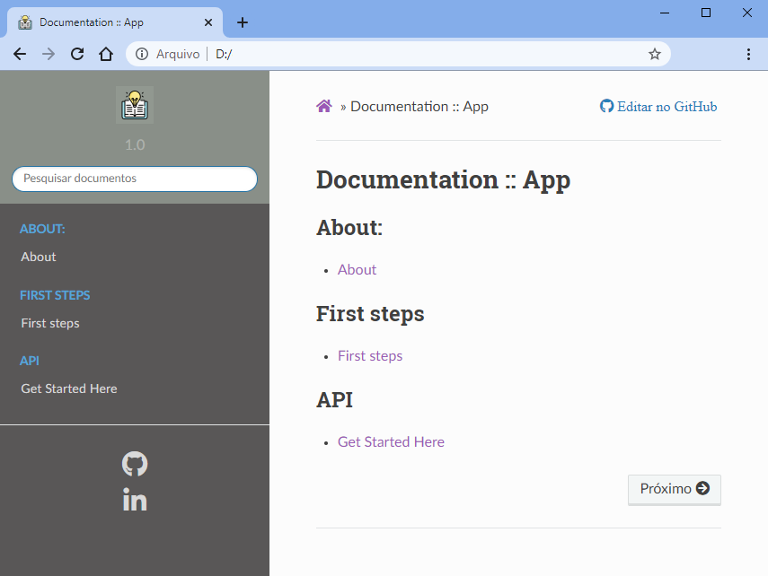

# Sphinex
Documentar projeto.

## Estrutura resumida de pastas e arquivos
```text

Sphinx
├── _build/
│   └── html/
│      └── index.html
├── _ext/
├── _static/
├── _templates/
├── pages/
├── conf.py
├── index.rst
├── make.bat
├── Makefile
└── README.md

```

## Instalação
- `pip install -U Sphinx`;

## Criar arquivo de configuração básico
```sh
	sphinx-quickstart
	> Separate source and build directories (y/n) [n]: n
	> Project name: app
	> Author name(s): user_dev
	> Project release []: 1.0
	> Project language [en]: pt_BR
```

## Configurações adicinais
- html[title,logo,favicon,theme]
- extensions
- css custom

Adicionar em `conf.py`.
```py
	# html custom
	html_title = 'Documentation'
	html_logo = '_static/book.png'
	html_favicon = '_static/book.png'
	html_theme = 'sphinx_rtd_theme'
	# extensions
	extensions = [
		'sphinx.ext.autodoc',
	    'sphinx.ext.graphviz',
		'sphinx.ext.todo',
		'sphinx.ext.viewcode',
		"myst_parser",
	]
	# css custom
	def setup(app):
		app.add_css_file('css/custom.css')

```

## Gerar documentação em formato HTML
```sh
	sphinx-apidoc -o . ..
	make clean & make html
```

## Resultado


## Referências
- https://www.sphinx-doc.org/